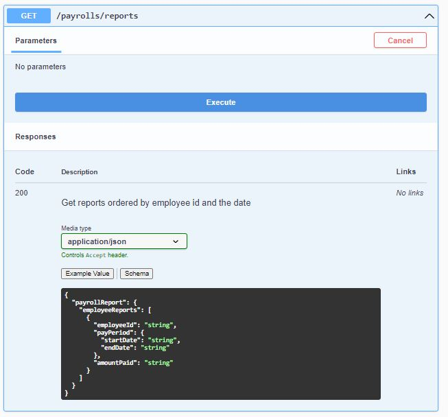

<h1 align="center">
  The Payroll System
</h1>

<p align="center">A sample payroll system, using Nest.JS + MongoDB</p>

____

## Description

This project is part of a challenge that the main goal is to create a new payroll system API that have two goals:

1. Upload a CSV file containing data on the number of hours worked per day per employee
1. Retrieve a report detailing how much each employee should be paid in each _pay period_

I decided to use NestJS because I am more familiar with the Node.js / Javascript / Typescript ecosystem and I believe that NestJS, being an agnostic framework, gives us flexibility when creating a Rest API.

I also decided to use MongoDB because, as the number of information can grow exponentially with the import of CSV files, a non-relational database is good on these occasions because it is fast and has a more flexible schema.

The application is separated into a few layers:

- Controller - responsible for receiving client requests
- Service - works as an intermediary, processing information and communicating with the Controller and the Repository
- Repository - communicates with the database (in this case, MongoDB)

With this separation, it is possible to test the application more easily, besides making the maintainability of the code better. In addition, I separated the pure functions to be able to use throughout the project.

To make the project simpler, just created an entity called `TimeReport` where the information coming from the CSV is saved. From it, information search and manipulation operations are performed to return in the expected structure. However, for a better understanding of the project, types and interfaces were created.

## Prerequisites

To run the code, you need to have installed one of these options:

- [Node.js](https://nodejs.org/en/download/) + [MongoDB](https://www.mongodb.com/try/download/community)
- or [Docker Desktop](https://docs.docker.com/desktop/) for Mac / Windows
- or [Docker Engine](https://docs.docker.com/engine/) for Linux
- or Docker + [Skaffold](https://skaffold.dev/docs/install/)

## Running the project

### Docker

To run the project with docker, you need to duplicate the `.env-docker-sample` file by renaming it to `.env`.

After that, run the code:

```bash
npm run docker:up
```

### Locally

To run on your machine, first you need to have MongoDB installed.

> Tip: you can download it [HERE](https://www.mongodb.com/try/download/community)

Then install the dependencies running:

```bash
npm run install
```

Then duplicate the `.env-local-sample` file by renaming it to `.env`.

Finally, there are three ways to run the application:

```bash
# development
$ npm run start

# watch mode
$ npm run start:dev

# production mode
$ npm run start:prod
```


### Skaffold (under development)

The easiest way to run the project with kubernets is to have:
- [Skaffold](https://skaffold.dev/docs/install/) installed
- Duplicate the `.env-k8s-sample` file by renaming it to `.env`.
- Running the following command in the main project folder:

```bash
skaffold dev
```

And then, to know the server port use the command:

```bash
kubectl get services
```

> E.g. http://localhost:3000

## The API

After start the API, you can open `http://localhost:3000/api` and the Swagger documentation:


### POST /payrolls/upload

The first endpoint listed is `POST /payrolls/upload` that we can send a CSV file:


But, if the report id was already used, the API returns an error to the client:


### GET /payrolls/reports

The second is the endpoint where we will get all the reports, with the appropriate sums, multiplications, and segmentation by period:



In the example below, we see the return of 2 two reports processed in the same return:


### GET /

To check if the API is running, we can access `http://localhost:3000/` and see if will return the version of it.


## Test

The project was covered using Jest. You can run some of these commands below:

```bash
# unit tests
$ npm run test

# e2e tests
$ npm run test:e2e

# test coverage
$ npm run test:cov
```


> Tip: you can see that report in `./coverage/lcov-report/index.html` file:


## Test by Postman

If you like Postman, I there is a file in `docs/payroll_system.postman_collection.json` for you :)

## Roadmap

* [x] Add Swagger
* [x] Add docker-compose
* [ ] Fix e2e tests
* [ ] Deploy in somewhere
* [ ] Add more tests to cover more possibilities
* [ ] Add alias to common paths/modules
* [ ] Add filters in GET /payrolls/reports

## Stay in touch

- [LinkedIn](https://www.linkedin.com/in/wenderpmachado/)
- [Instagram](https://www.instagram.com/wenderpmachado/)
